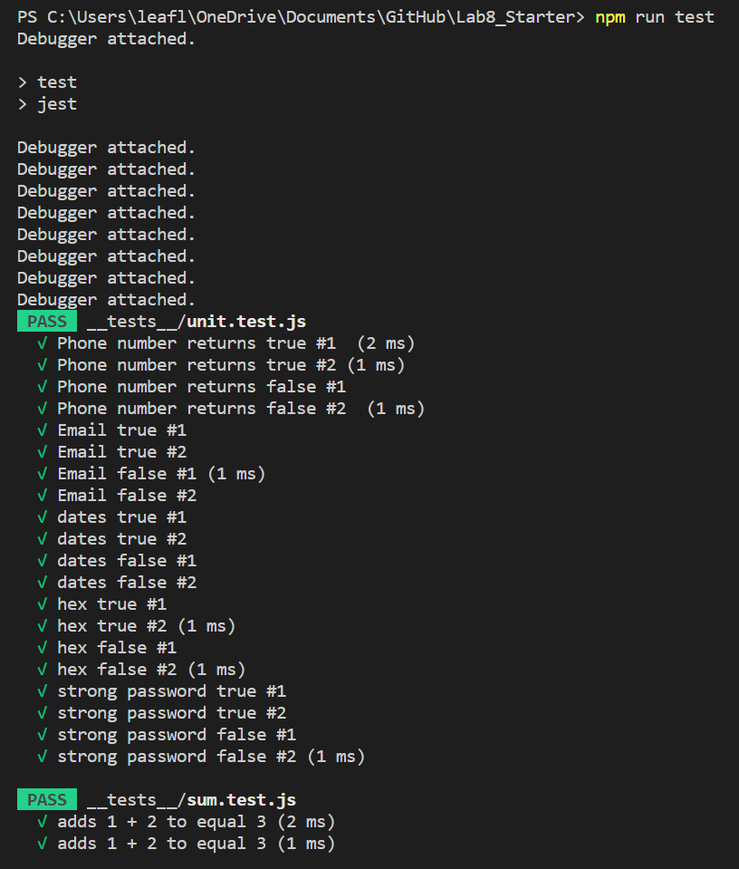
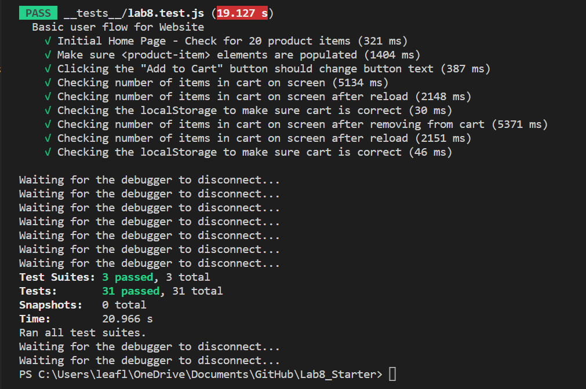

# Lab 8 - Starter

## Name
    Shuo Wang
## Check Your Understanding
1) Where would you fit your automated tests in your Recipe project development pipeline? Select one of the following and explain why.

- Within a Github action that runs whenever code is pushed 
- Manually run them locally before pushing code
- Run them all after all development is completed

> Selection: -Within a Github action that runs whenever code is pushed 

Because we want to check whether our code run as our expection, run and pass all the automated tests, make this simple and efficient.

2) Would you use an end to end test to check if a function is returning the correct output? (yes/no)
   
   No. Because it an end to end test does not check if a function is returning the correct output. Rather than that, it only check whether all functions can run from start to end. We prefer to use unit test here.

3) Would you use a unit test to test the “message” feature of a messaging application? Why or why not? For this question, assume the “message” feature allows a user to write and send a message to another user.
   
   No. Because "message" feature is not just one function that can be test with unit test.

4) Would you use a unit test to test the “max message length” feature of a messaging application? Why or why not? For this question, assume the “max message length” feature prevents the user from typing more than 80 characters.

    Yes. Beccause we can use one function to test the "max message length" feature.

## Screenshots

